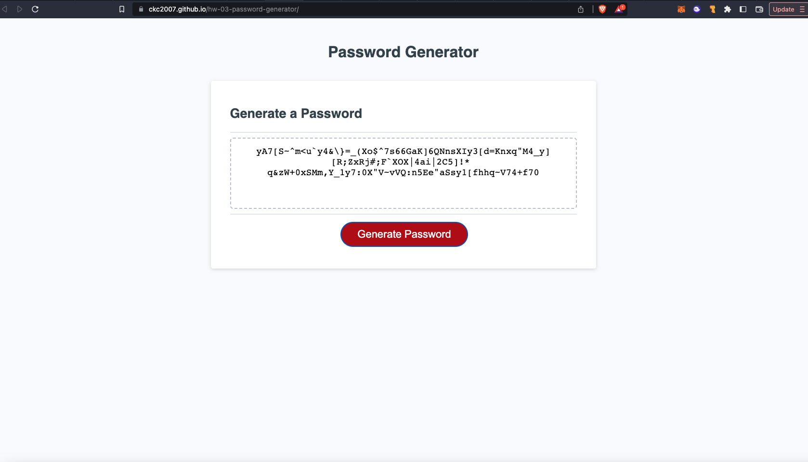

# 03 JavaScript: Password Generator

```
A password generator that takes user input for selected criteria, and returns a randomized password that meets those criteria.
```

## Description

```
User inputs the desired length of the password (between 8 and 128 characters),
User selects at least one character type (upper Case, lower Case, numeric, or special characters)
The password generator will disply the password in the text area.
```

## User Story

```
AS A user of the random password generator web app
I WANT to choose the length of the password, and the type of characters I want to have included in my password
SO THAT I can customize the length and complexity of the password I want to use.
```

## Acceptance Criteria

```
GIVEN I am generating a random password
WHEN I click the generate password button
THEN I am prompted with a series of questions asking for the criteria I want for my password (length and character types)
WHEN I answer the question by clicking on the prompt button ('ok' for yes, 'cancel' for no)
THEN a confirmation alert is displayed and I am taken to the next question
WHEN all questions are completed
THEN a password in the form of a string is displayed in the text area
```

## Deployed Page

[https://ckc2007.github.io/hw-03-password-generator/]



```
The above is a screenshot of the deployed page
```
